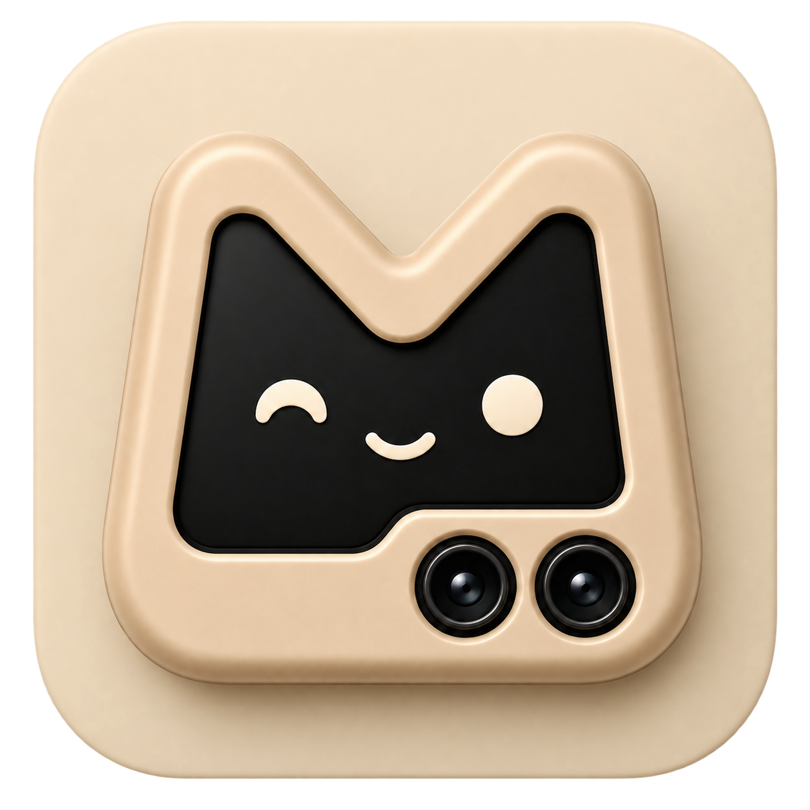

# MiniMate

Your folded phone, doing something useful.

MiniMate turns the cover display of a Samsung Galaxy Z Flip into a touchpad, a
keyboard, a microphone and a webcam for your Mac or PC.

Built for the Galaxy Z Flip 7 FlexWindow.

## What it does

- **Touchpad** — pointer, tap to click, drag, two-finger scroll and right click.
  The surface is a living piece of art: it moves, it reacts to your fingers, and
  you can change everything about it.
- **Scroll rail and click corner** — along the edge and in the corner, where your
  thumb already is, so the whole thing works one-handed.
- **Keyboard** — swipe typing, symbols, shortcuts and media keys. Tell it whether
  it is talking to a Mac or to Windows and the keys are named to match.
- **Microphone** — the phone's mic becomes your computer's, with echo
  cancellation and noise suppression.
- **Camera** — the phone's camera becomes your webcam.

The touchpad and keyboard speak Bluetooth HID, so they work against anything
that accepts a Bluetooth mouse and keyboard, with nothing installed on the other
end. The microphone and camera are not HID — those need the companion.

## The companion

A small app for the computer that installs a virtual microphone and a virtual
camera, then carries sound and pictures over Wi-Fi, falling back to Bluetooth.
macOS and Windows.

Download both from [Releases](https://github.com/RimorCosmicam/miniMate/releases).

## Building

Everything is built by GitHub Actions — the Android app, the macOS installer and
the Windows executable. Push to `main` and take the artifacts from the run, or
start the workflow by hand.

```
gh run download <run-id> -R RimorCosmicam/miniMate -n minimate-debug-apk
```

The macOS job also installs its own package and launches the app, so a build
that passes has been installed at least once.

## Open source

MIT. Do what you like with it (but let me know, I love cool stuff).
